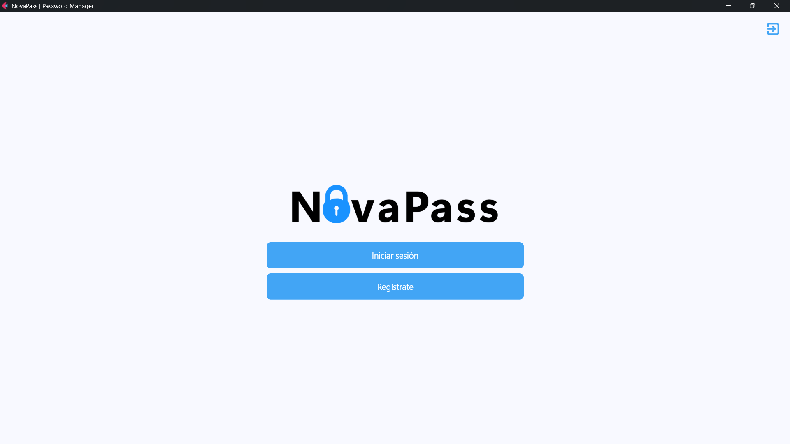
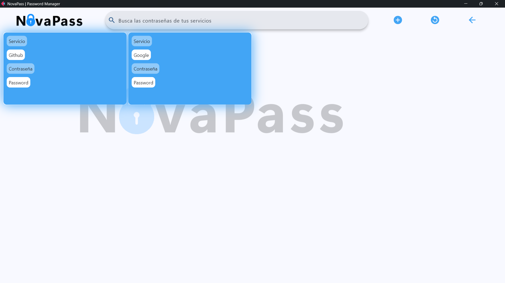

# NovaPass: Aplicación de Gestión Segura de Contraseñas

<div align="center">
  
  
  <br>

  
  
  
</div>

---

## Descripción General

**NovaPass** es una aplicación local de gestión de contraseñas desarrollada con Python, diseñada para ayudar a los usuarios a almacenar y administrar sus contraseñas de servicios con un cifrado robusto. La aplicación proporciona una interfaz fácil de usar para guardar, recuperar y gestionar contraseñas de manera segura.

## Características Principales

### 🖥️ Interfaz de Usuario
Construida con **Flet** para ofrecer una experiencia moderna.


*Vista general del gestor de contraseñas*

### 🔐 Cifrado Avanzado
- Utiliza cifrado **AES-256**.
- Genera una clave única por instalación.
- Cifra archivos CSV completos.


## Tecnologías Utilizadas

| Categoría | Tecnología |
|-----------|------------|
| **Framework** | Flet (GUI) |
| **Cifrado** | PyCryptodome (AES-256) |
| **Datos** | Pandas & CSV |
| **Lenguaje** | Python 3 |

## Mecanismo de Cifrado

NovaPass implementa un sistema de cifrado sofisticado:
1. **Generación de Claves**: Crea una clave de 32 bytes en `encryption_key.key`.
2. **Cifrado**: Convierte a JSON -> Genera IV -> Cifra con AES (CBC) -> Base64.
3. **Descifrado**: Invierte el proceso asegurando la integridad.

## Instalación y Ejecución

1. Instalar dependencias:
   ```bash
   pip install flet pandas pycryptodome

